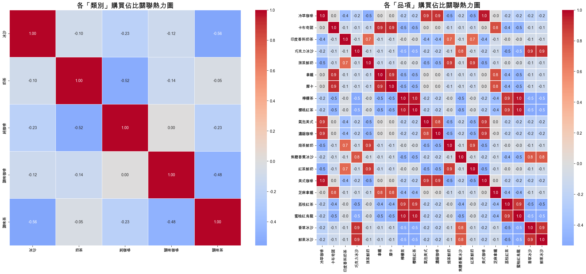
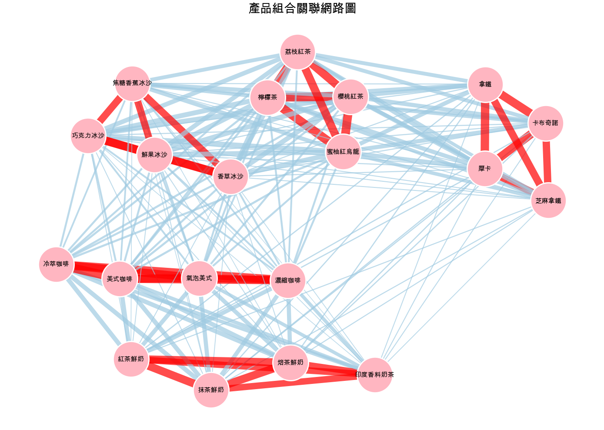

## Before you Start

### 1. 產品與客群的分類

#### 產品分類：

基底： 咖啡 vs. 茶 vs. 冰沙。

口感： 清爽型 (純茶、冰沙) vs. 濃郁型 (奶茶、拿鐵)。

機能： 提神 (高咖啡因) vs. 療癒 (高糖)。

#### 客群畫像：

核心提神型：每天早上一杯美式，講求效率與咖啡因。

精緻午茶型：偏好奶茶、拿鐵，喜歡多層次的味覺體驗。

年輕學生黨：只有夏天或下午會買冰沙、果茶。

價格敏感型：專挑促銷期間購買，或主要持有金卡/鑽石卡會員以獲取折扣。

### 2. 營運約束與資料需求

#### 營運約束： 

在尖峰時段處理冰沙的效率遠低於美式。如果某個群體過大，贈送該群體冰沙券可能會導致店內排隊過長。

#### 所需資料：

除了基礎的會員資料與交易紀錄，我們還需要每個飲品的製作時間、產品的詳細成份（如咖啡因含量）等資料。

### 3. 為什麼給券優於折扣？

#### 新口味試探： 
折扣通常讓顧客買原本就會買的東西，而贈券可以引導顧客嘗試特定五種飲料，幫助清理庫存或推廣新品。

#### 刺激消費： 
100% 的免費感比 8 折更有感，能有效驅動顧客為了兌換「免費」券而進店，進而產生額外消費。

## Question 1: Descriptive Analysis

### 量化產品關聯的方法：
    計算相關係數，當某個會員買很多 A 品項時，他是不是也傾向買很多 B 品項？

### 結果：

1. 強負相關：
    - 「冰沙」與「調味茶」(-0.56)、「純咖啡」與「奶茶」(-0.52) 具有明顯的負相關 。  
    - 推測：冰沙口感較濃郁，而調味茶口感清爽；純咖啡主要是提神用，奶茶主要是調劑用，因此兩者呈現負相關。

2. 強正相關：
    - 在品項圖中，同一個類別中的飲品具有高度正相關。例如「美式咖啡」與「冷萃咖啡」、「蜜柚紅烏龍」與「檸檬茶」。
    - 推測： 顧客對於「基底」非常忠誠，會在同一種類別中的飲品中做選擇。